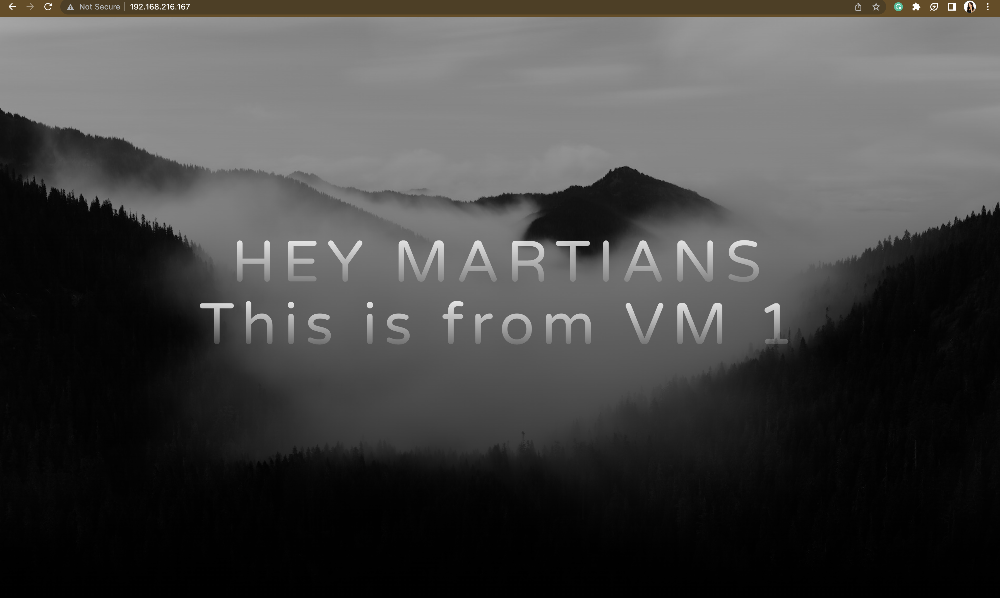

# Distributing Traffic Across 2 Ubuntu Virtual Machines Using a Load Balancer (All done Locally).

## Task
- Install Linux VMs.
- Using bash script: install nginx from source, add nginx and group, create a cron job to backup nginx folder to your home directory everyday.
- Use a Load balancer to distribute traffic across virtual machines.

## The Aim of this task includes:
- Implementing load balancers so as to equally distribute traffic among VMs.
- Using bash script to install nginx from source (advantages include: flexibility of customizing the installation such as tailoring the installation to your specific needs,  and having access to latest nginx versions).
- Using bash script to write a cron job to backup nginx folders so as to prevent loss of data.
- Using bash script to create nginx group and user to restrict access.

## Thought Process
- Install a hypervisor (a software used to create and run virtual machines) and create Virtual Machines on it (I will be installing an Ubuntu server and making 2 extra copies which will serve as clones from the server).
- Install nginx from source, create cron job for back up, and add nginx user and group in one bash script.

## Requirements
- A Hypervisor (VirtualBox)- On which I will install my VMs.
- 3 Ubuntu VMs (1 Original and 2 Cloned VMs).
- Terminal - I will use to access my scripts and nginx files.
- GitHub - I will be cloning a sample application from github and also for version control.
- Lucid charts - used to draw architecture diagram.
- Nginx - which will serve as a load balancer and a web server.

## Architecture Diagram


## Steps
- Download and install a hypervisor ([Virtual box](https://www.virtualbox.org/wiki/Downloads) in my case) based on your operating system.
- Download the *iso file* of your preferred Linux distro ([Ubuntu](https://ubuntu.com/download) in my case) which will serve as a guest OS, then add the _iso file_ to virtual box.
- Install Ubuntu and start the VM.


- Create a linked clone of this VM (a linked clone shares resources like virtual disks with the parent VM after its creation).


- At this stage, I have 3 VMs, I will install nginx on all VMs (but nginx will serve as a web server on VM 1 & 2, and as a load balancer on VM3).

- Before creating the bash script, it is necessary to:
  - install ssh-server using ```sudo apt install openssh-server ```  
  - enable ssh with ```sudo systemctl enable ssh --now```
  - verify ssh status with ```sudo systemctl status ssh```
  - SSH into each VM with ```ssh <hostname@ipaddress>```
  - install git with ```sudo apt install git```
- Clone an app from github using ```git clone <repo-url>``` and store in a preferred location (home directory in my case) while taking note of the path.
- To write a bash script, ensure the script has the ```.sh``` extension (my bash script is named nginx_script.sh).
- To execute the script, it has to be given the executable permission using ```chmod u+x nginx_script.sh``` and run with ```./nginx_script.sh```.

- ```nginx_script.sh``` does the following on each VM:
  - Updates the system and installs the required dependencies.
  - Downloads nginx source code with preferred version (latest version).
  - Extracts the downloaded file.
  - Configures nginx with preferred modules (I will be using minimum configurations).
  - Builds and Installs nginx.
  - Checks nginx version (a way of showing nginx is installed).
  - Creates nginx systemd service file.
  - Create the directories for my website files.
  - Move or Copy my website directory into one of the created folders (/var/www/html), and navigating to that path to start the application.
  - Edits the default Nginx configuration file in the /etc/nginx/sites-available directory (named default).
  - Creates a symbolic link to enable the default configuration.
  - Backs up the original nginx.conf file to nginx.conf.bak file.
  - Verifies the nginx configuration.
  - Reloads the systemd daemon, enables, starts and shows nginx status.
  - Restarts nginx for any change to take effect.
  - Creates a group named nginx_grp.
  - Creates a user (nginx_user) and adds to the group created above.
  - Creates a cron job to back-up nginx files to home directory at midnight everyday.

__Note that__ this script will be run on all VMs with slight changes such as:
- VM1 and VM2 will have different app landing pages so as to show what virtual machine receives traffic from the load balancer at any given time.
- VM3 will not have a custom application because nginx will act as the loadbalancer.

## File Structure
- images - this directory contains screenshot of images I captured while working on this task.
- web-app1 - this directory contains the application code that will be served on VM1.
- web-app2 - this directory contains the application code that will be served on VM2.
- loadbalancer_config.sh - contains the configuration for the load balancer which is supposed to be in VM3 nginx conf file (where I specified the IP addresses of the VMs traffic should be routed to).

## Important Nginx files
- ```/var/log/nginx/access.log``` :records the activity of all the visitors to your site, it contains sensitive information and can be used to see what pages are being visited, what files are being requested, where users are coming from, etc.
- ```/var/log/nginx/error.log``` :records any issues, glitches, that the application might encounter.
- ```/etc/nginx/nginx.conf``` : this is the main configuration file for nginx, but every nginx configuration file is found in ```/etc/nginx/``` directory. 

__For changes to the configuration file to take effect, it must be restarted using ```sudo systemctl restart nginx```__.

__Output from VM1 with IP 192.168.216.167__




__Output from VM2 with IP 192.168.216.202__


__Output from VM3 with IP 192.168.216.140__

<video src="/Users/kenechukwuojiteli/Desktop/Kene-Deimos-Tasks/Module1/Demo-video.mp4"></video>
