# Containerizing a PHP Application linked to a MYSQL database using Apache as a Web Server.

## Task (Including Containerizing and Orchestration).
- Using a Web server, Dockerize a PHP application that is linked to a mysql database, Application should be accessible on your localhost and form should be able to write to database using containers and relevant networking,

Additionally,
- Use docker-compose to create the application and database backend and let data persist on container restart.

- Create a kubernetes cluster locally, i.e. docker for desktop has 1 built in but Minikube, kind or k3s can be used
Using the application and database containers you created in module 2:

- Create a deployment manifest for application and a stateful set for the mysql instance

- Expose application service so it's accessible like you have done with containers

## Aim and Learning Outcomes.
The aim of this project is to containerize a php application running on Apache and connect to a mysql database. Learning outcomes include knowledge of docker containers, images, volumes, networks and web servers.

## Important Terms to note.
- `Docker` - an open platform for developing, shipping, and running applications. Docker enables you to separate your applications from your infrastructure so you can deliver software quickly.
- `Containers` - runnable instance of an image.
- `Docker Volumes` - used to persist data outside the container so it can be backed up or shared, the volumes are stored in `/var/lib/docker/volumes`.
- `Docker Images` - are blueprints of our application that form the basis of containers.
- `Docker Network` - allows you to create a Network of Docker Containers managed by a master node called the manager.
- `Dockerfile` - a text file that contains instructions to build an image.
- `Docker Compose` - a tool used to setup multi-containers.
- `Web server` - a computer program that accepts and responds to requests from clients eg Apache.
- `Apache` - a free and open-source software that is used to serve web pages and other content over the internet.

## Requirements.
<!-- - Virtual Machine - to test application locally. -->
- Homebrew - a package manager to install software.
- Docker desktop and docker installed.
- Any Browser - to access a running container using host's port.
- Terminal - used to build images and run containers.
- A Code Editor (VS Code) - to edit source code and dockerfiles.
- GitHub and Dockerhub account.
- Minikube or Docker desktop (which kubernetes will be enabled on) - which installs a single node kubernetes cluster.

## Folder Structure.
- Module2 - main folder for this project.
  - img - contains screenshots of my progress while carrying out this task.
  - Task1 - contains folders which will be used to create 3 containers (1 php running on apache, 1 mysql and 1 phpmyadmin) that will connect on the same network.
    - data - contains the `sql` file that will be mounted to the mysql container as a volume.
    - php - contains the `.html` and `.php` source code.
    - .env - contains the sensitive credentials required.
    - Dockerfile - contains the instructions that will be used the build the php-apache image.
  - Task2 -contains the necessary folder requirements that will be used to create a php container linked to a database.
    - db - contains database table requirements that will be mounted on the database (automatically creates the database and tables).
    - src - contains source code written in php and html.
    - .env - contains the sensitive credentials required.
    - docker-compose.yml - a file that simplifies how multiple containers are created (instead of using docker run command multiple times). 
  - .dockerignore - contains files and folders that should be excluded when building a docker image.
  - .gitignore - contains files and folders that should not be tracked by git.
  - docker-commands - contains all docker commands used while working on this task.
  - README.md - contains the detailed steps and guidelines for this project. 

## The steps taken involves 2 stages and they are:
- Testing the application locally to ensure the application is functional. 
- Containerizing the application using dockerfile.
- Containerizing the application using docker-compose.
- Orchestrating the application with kubernetes (using deployment and statefulset).
- Over and above Features (Implementing monitoring and Automating docker builds and pushing docker image to dockerhub using github actions).

#### Stage 1: Containerizing the application using dockerfile.
- Download and install [homebrew](https://brew.sh/) and verify installation using `brew`
- Install docker via brew using `brew install --cask docker`, it also installs docker-compose automatically.
- Create project folders using the guide provided in folder structure.
- Navigate to project folder containing dockerfile and create a network with `docker network create --driver bridge <networkname>`.
- Build image using `docker build -t my-php-app . `, where `my-php-app` is my preferred name and `.` is the current directory.
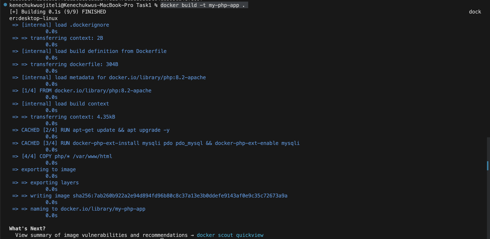
- Create 3 containers from images with:
  - `docker run -d -p 7080:80 -v ./php:/var/www/html --env-file .env --network test-network --name app my-php-app` - this container runs in a detached mode and maps container port 80 to the host's external port 7080 (which will be used to access the container on my browser), adds source code as a volume (this will be used to persist data even when the container is stopped and restarted), adds the env file, attaches the network earlier created and gives the container a custom name.
  - `docker run -d --name db --network test-network -v dbdata:/var/lib/mysql -v ./data:/docker-entrypoint-initdb.d -e MYSQL_ROOT_PASSWORD=ninja1 -e MYSQL_DATABASE=feedback -e MYSQL_USER=kene -e MYSQL_PASSWORD=passwordtest -p 3307:3306 mysql:latest` - adds required credentials as environment variables, attaches network, maps port and adds sql file as a volume (to create table on the database once the container is created).
  - `docker run -d --name interface -e PMA_HOST=db  --network test-network -p 7081:80 phpmyadmin:latest` - adds a container name, an environment variable (PMA_HOST which define host name of the MySQL server), attaches a network, maps port and lastly the image with a tag (where the container will be built from).
  - Output from containers running on localhost using their ports:
   - php-apache container - `localhost:7080/index.html`
   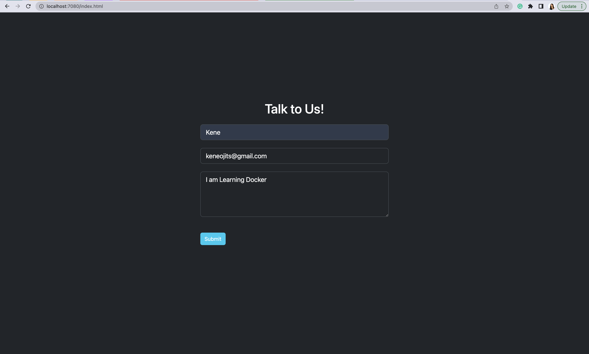
   - Success message after the form is submitted.
   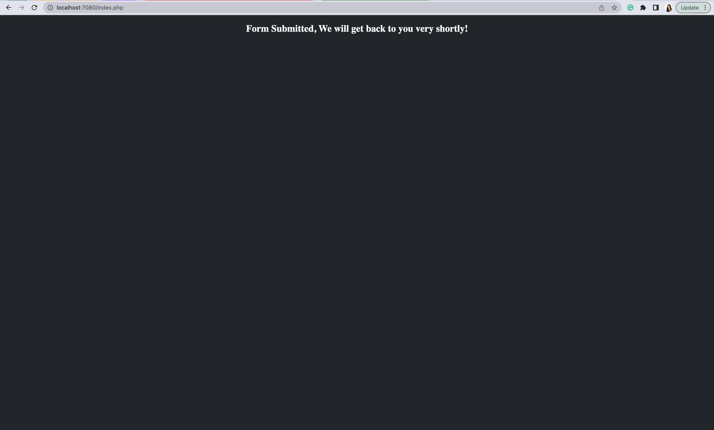

   - phpmyadmin container - `localhost:7081`
   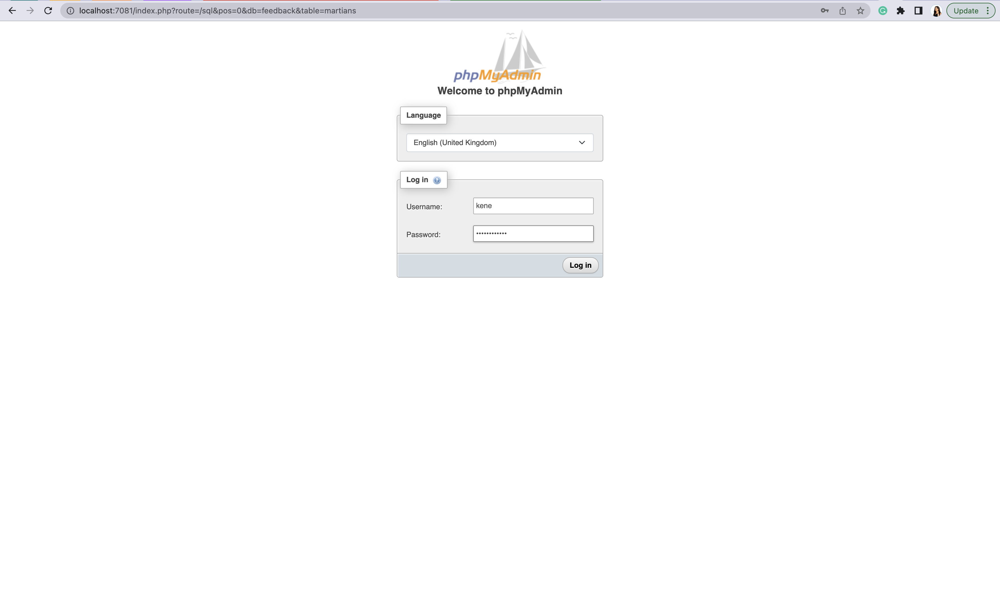
   - database table values (mounting my data folder automatically created my table on the web interface).
   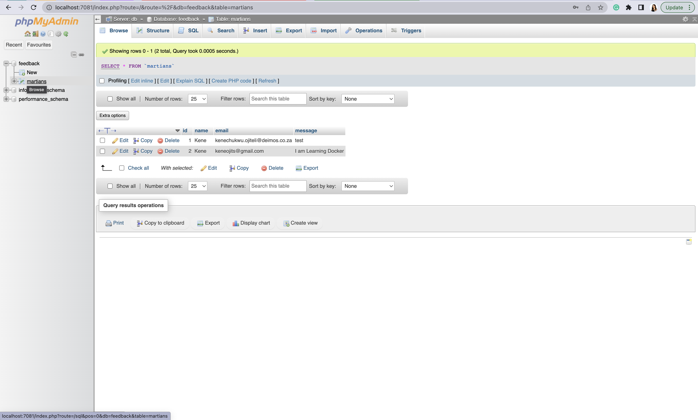

#### Stage 2: Containerizing the application using docker-compose.
- Navigate to project folder on your code editor (VS code in my case), and create nesessary files (docker compose, .env, sql, html and php file).
- On the docker compose file (which is a `yml` file), specify the version and the services (which is an array of containers which are to be built and run together when the docker-compose file is executed).
- For each service, specify the service name, image, ports, environment variables, volumes etc.
- On the `.env` file, specify the envrironment variables and credentials (it is advisable to put environment variables and credentials in an .env file so as to manage sensitive information consistently while maintaining its security).
- `docker-compose up --build` - command builds the services, pulls the images and creates containers from those images, creates a network and attaches the network to the containers.

- Output from containers running on localhost using their ports: it is similar to step 2 but with different ports: `localhost:80/index.html` and `localhost:8081`.

## Docker Commands used. 
- `docker info` - displays system wide information (such as kernel version, number of containers and images) regarding the Docker installation
- `docker version` - displays the current version of docker installed on the user's machine.
- `docker-compose up --build` - builds and starts multiple containers.
- `docker-compose down` - stops and removes containers, volumes, networks, and images created by `docker-compose up`.
- `docker inspect <networkname> /<containername>` - used to inspect a network or container.
- `docker logs <containerid>` -shows information logged by a running container.
- `docker-compose ps -a ` - shows a list of all containers (both running and exited containers).
- `docker network rm <networkname>` - removes a network using the network name.
- `docker images` - shows a list of all images.
- `docker rmi <image(s)>` - removes image(s).
- `docker network create --driver bridge <networkname>` - used to create a new network.
- `docker run -d -p 7080:80 -v ./php:/var/www/html --env-file .env --network test-network --name app my-php-app` - runs a php-apache container.
- `docker run -d --name interface -e PMA_HOST=db  --network test-network -p 7081:80 phpmyadmin:latest` - runs a phpmyadmin container.
- `docker run -d --name db --network test-network -v dbdata:/var/lib/mysql -v ./data:/docker-entrypoint-initdb.d -e MYSQL_ROOT_PASSWORD=ninja1 -e MYSQL_DATABASE=feedback -e MYSQL_USER=kene -e MYSQL_PASSWORD=passwordtest -p 3307:3306 mysql:latest` - runs a mysql container.
- `docker stop <containerid>` - used to stop a container.
- `docker restart <containerid>` - used to restart a container to test for data persistence.

## Orchestrating the application with kubernetes (using deployment and statefulset).
- Create a secret which will contain all the sensitive data (encode credentials using `echo -n 'value' | base64`).
- Create a deployment manifest for the stateless application (that is the php application), specify the number of replica, image, needed credentials as environment variables, and a service.
- Create a statefulset for the stateful application (the mysql) and specify the service (a headless service), credentials (which will be passed as env variables from the secret file), volume claim template (which is a list of claims that pods are allowed to reference) which will use the default storage class, and also volume mounts (this is the path in the container on which the mounting will take place).
- Note that volumeMounts.name == volumeClaimTemplates.metadata.name.
- Create the Secret using `kubectl create -f <nameofsecretfile.yml>` (Note that this should be created before it is referenced by other kubernetes resources).
- Create deployment and stateful set using `kubectl create -f <filename.yml>`.
- Use `kubectl get pods,svc,pv,pvc,sc,secret` to view what was just created.
- Accessing the shell of my php pod using `kubectl exec --stdin --tty <pod-name>  -- sh`
- Install a package that will help php pod communicate with mysql pod using `apt install mariadb-client` (initially used `apk add mysql-client && apk add mariadb-connector-c`).
- While inside the shell of the pod, create a folder in the current directory to copy the sql file present in my local folder. 
- Outside the pod's shell above,  copy my `data.sql` file to php pod using `kubectl cp <pathtolocalfile>  <pod-name>:<pathinpodfile>` for example: (`kubectl cp /Users/kenechukwuojiteli/Desktop/Kene-Deimos-Tasks/Module2/k8s/data.sql php-app-deployment-86758d497-nr2pk:/var/www/html/mysql`) to the folder created in the pod.
- Login to mysql from the php container's shell specifying username, hostname, database name and the the path containing the sql file `mysql -u kene1 -p -h mysql-statefulset-0.mysql-service.default feedback < /var/www/html/mysql/data.sql`, this command will prompt you for a password.
- Login to mysql container from the php container's shell (first as a root user, then create a new user and grant privileges with `GRANT ALL PRIVILEGES ON *.* TO '<newuser>'@'%';`) using `mysql -u kene1 -p  -h mysql-statefulset-0.mysql-service.default`(-h is the hostname which is gotten by: `podname.servicename.namespace` of statefulset).
- `show databases;` - to view the databases already available.
- `create database <dbname>;`- to create a database.
- `use <dbname>;` - to use the named database as the default (current) database for subsequent statements.
- `show tables` - shows the tables in the current database (notice that a db table is available, this is because we appended the sql file to the database, done 5 steps above).
- Access the php application on a browser and try to submit data (ensure that the env variables are included in the php deployment, making sure to note that the env variable `name` corresponds with key value in .env file and also corresponds with env variables passed to the php script ) as seen below:

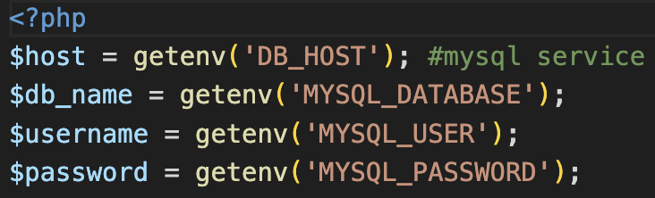

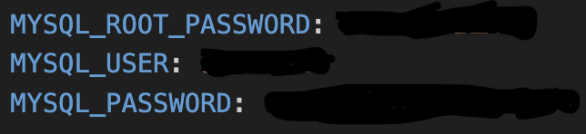

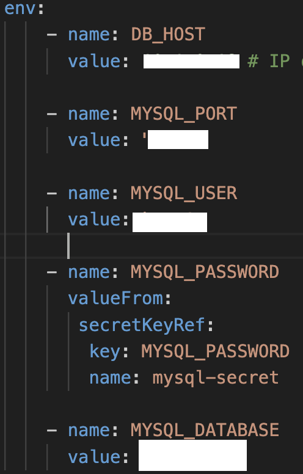

- After writing to the database, the db will be queried with `select * from martians;` to see values.
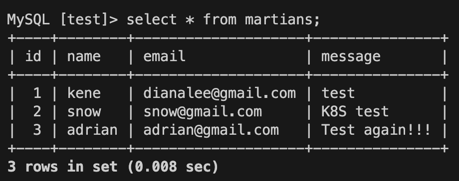
## Best Practices Observed.
- Used a .env file to store and manage sensitive information.
- Created a .dockerignore file to store sensitive files to be excluded when building an image.
- Created a .gitignore file to store files that will not be tracked by git.
- Applied the principle of least privilege, I created another mysql user and restricted privileges.
- Used official images as base images.

## Over and Above.
- This involves implementing the following features:
  - Monitoring the performance of my docker containers using prometheus and grafana (this can be done by integrating docker desktop with grafana cloud or using prometheus,grafana and exporter images) - my preferred choice was integrating docker desktop with [grafana cloud](https://www.docker.com/blog/unlock-docker-desktop-real-time-insights-with-the-grafana-docker-extension/) and adding docker desktop as a data source (the location where data that is being used originates from), this process is way easier and seamless. Other options I explored includes using the `docker stats ` command and pulling prometheus, grafana and node exporter images using prometheus as a data source.

  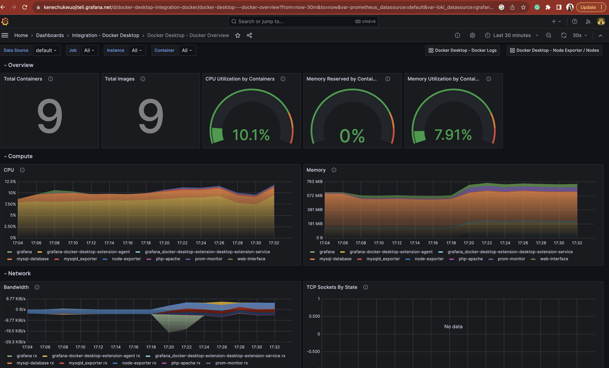
  <!-- engine_daemon_container_states_containers{state="running"}
  count (sum by (image) (container_last_seen{job=~".+", instance=~".+", name=~".+", image=~".+"})) -->

  <!-- - Setting a CICD pipeline when pushing image to dockerhub: A work in progress!!! -->
  <!-- create an automated CI/CD build with GitHub and DockerHub -->
  - Automating docker builds and push a Docker image to DockerHub with github actions: This was achieved by:
    - Login in and creating access key from dockerhub which github actions will use to access dockerhub account.
    - Add docker credentials (access token created earlier and username) as secrets on project repository.
    - Setup a workflow that will build image, login to dockerhub and commit changes to push image to dockerhub.
    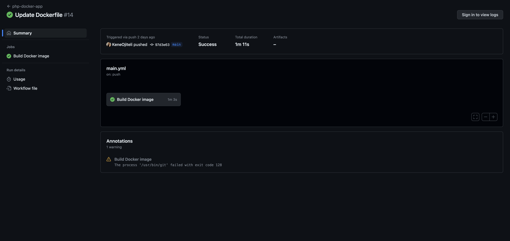
    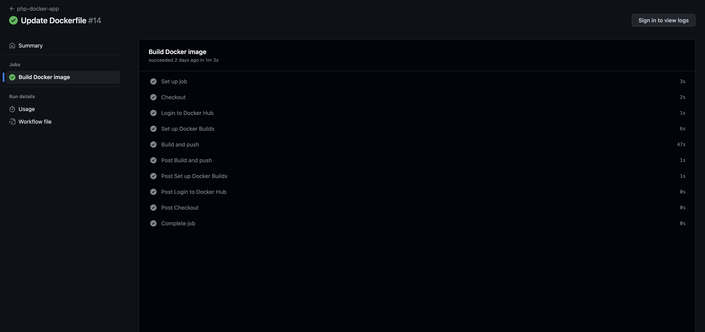
    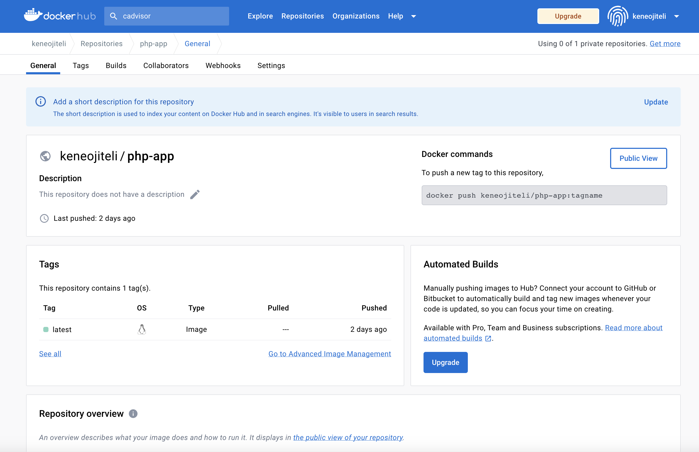

## Challenges Encountered.
- __Challenge 1__: I encountered an access denied error while trying to submit the form which will write data to mysql database.
- __Cause__: this was caused by comment on my .env file (apparently, .env is a text file and does not recognize commented lines). 
- __Solution__: this was resolved by removing comments and extra spaces from .env file.
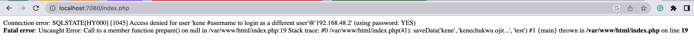

- __Challenge 2__: I encountered a could not find driver error while trying to submit the form which will write data to mysql database.
- __Cause__: this was caused by the absence of the required PHP extensions. 
- __Solution__: this was resolved by adding PHP extension that will connect the PHP Apache to the MySQL server on the dockerfile.
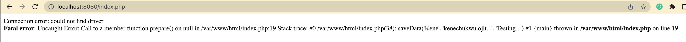

- __Challenge 3__: I encountered issues with accessing phpmyadmin.
- __Cause__: this was caused by invalid login details. 
- __Solution__: this was resolved by using the appropriate login details (for both other user and root while testing).

- __Challenge 4__: I encountered a cName or service not known error while trying to submit the form which will write data to mysql database.
- __Cause__: this was caused by inconsistency in environment variables across deployment file, secret file and php script. 
- __Solution__: this was resolved by making the environment variables uniform.

<!-- GRANT SELECT, INSERT, CREATE ON `feedback`.* TO `kene`@`%` WITH GRANT OPTION; -->

