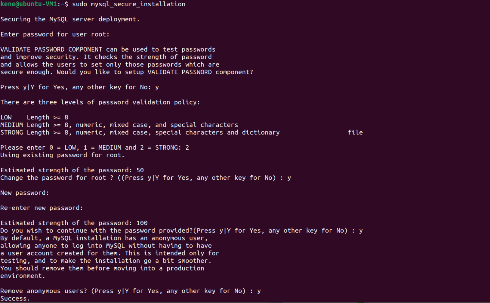

#### Stage 1: Testing the application locally to ensure the application is functional.
- The following modules and dependencies will be installed on my Ubuntu VM:
  - `sudo apt update` - to update the system repository.
  - `sudo apt install apache2` - to install apache2 which will be used as our web server.
  - `sudo apt install php` - installs php.
  - `sudo apt install php-mysql` - installs a PHP module that allows PHP to communicate with MySQL-based databases.
  - `sudo apt install mysql-server` - installs mysql server.
  - `sudo ufw allow "Apache"` - allows traffic on Apache (Port 80) through the fire wall with Ubuntu's default firewall configuration tool called Uncomplicated Firewall (UFW).
- Verify that apache is installed and accessible through firewall by viewing the default Apache web page with `http://<ip-address>` on your browser.
- This stage involves some configurations such as:
  - `sudo apache2ctl -M` - checks the Apache HTTP server.
  - `sudo a2dismod mpm_event` - disables event MPM module (a2dismod is used to disable a module).
  
  - `sudo a2enmod mpm_prefork` - enables pre-fork MPM module.
  - `sudo a2enmod php8.1` - enables the version of the php you installed (make sure to leave no space between php and the version number).
  
  - `sudo nano /etc/apache2/sites-available/<name>.conf` - Open a new configuration file in Apache’s `sites-available` directory with your preferred editor (when editing the file, do not forget to add your IP as the virtual host).
  

  - Create a virtual host (which will be used to encapsulate configuration details and host more than one domain from a single server) for our website (apache's virtual host is hosted `/var/www/html` directory),The following will be done:
     - Create a new directory with `sudo mkdir <directoryname>`
     - Create and edit the `form.html` and `form_submit.php` file.
     - Copy the files created above to the `/var/www/myproject` folder.
     - Change ownership to the current user, change permission.
     - Disable apache's default website with `sudo a2dissite 000-default`.
     - Ensure configuration file doesn’t contain syntax errors with `sudo apache2ctl configtest`
     - Enable the new virtual host with `sudo a2ensite <name>`.
     - Reload Apache so these changes take effect with `sudo systemctl reload apache2`.
  
  
  
  
     - I'll also edit the `/etc/apache2/mods-enabled/dir.conf` file so as to modify the order in which the `form.html` and `form_submit.php` file is listed within the DirectoryIndex directive.
  
     - Reload Apache so these changes take effect with `sudo systemctl reload apache2`.
- After installing mysql-db which will be used to store and manage data for your site, it’s recommended to run a security script that comes pre-installed with MySQL, which will remove some insecure default settings and lock down access to your database system

- I had some authentication issues and needed to adjust how my root MySQL user authenticates by:
  - Opening up the MySQL prompt with `sudo mysql` and changing the root user’s authentication method to one that uses a password with `ALTER USER 'root'@'localhost' IDENTIFIED WITH mysql_native_password BY '<somevaluehere>';`

- Exit the mysql prompt with `exit`.
- Run the interactive script using `sudo mysql_secure_installation` to configure the VALIDATE PASSWORD PLUGIN.

- Also,this will remove some anonymous users and the test database, disable remote root logins, and load these new rules so that MySQL immediately respects the changes you have made.

- After the script is completed, reopen mysql (with the root user's new password) and change the root user's authentication method to the default.

- Create a new user and a new database.

- With the `use` statement, I'll change the current db to the named database and also create a new table named `martians`.

- Next, I'll be granting the newly created user appropriate privileges (Take note to only grant the required privileges and not give user total control over the database).

- Using the `FLUSH PRIVILEGES` command reloads the grant tables to ensure that the new privileges are put into effect.

- You can also view privileges granted to a user.

- Login as new user. 

- Fill and submit the form and check if it was impacted on the database.
